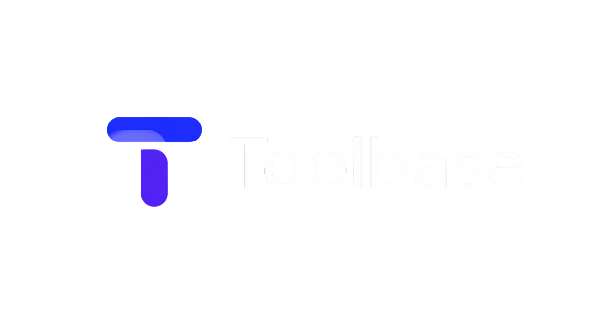

<p align="center">
  
</p>

<p align="center">
  <strong>Every tool you need. Zero data leaves your machine.</strong>
</p>

<p align="center">
  <a href="https://toolbase.in"><strong>Use Toolbase online →</strong></a>
  &nbsp;·&nbsp;
  <a href="./CONTRIBUTING.md">Contribute</a>
  &nbsp;·&nbsp;
  <a href="./docs/README.md">Documentation</a>
</p>

<p align="center">
  <a href="LICENSE"></a>
  <a href="CONTRIBUTING.md"></a>
  <a href="https://webassembly.org"></a>
  <a href="https://pyodide.org"></a>
</p>

---

## What is Toolbase?

**Toolbase** is a free, open-source collection of everyday tools—PDF, images, data, security, drawing, and more—in **one website**. Open a tool, drop in your file or paste your text, and get results **without uploading anything to a server**.

Your files stay on your computer. Processing runs inside your browser using WebAssembly and Web Workers, so heavy jobs do not freeze the page.

**Good for:** developers, analysts, and anyone who cannot (or will not) send sensitive files to random online converters.

---

## Try it now

No account. No install.

👉 **[toolbase.in](https://toolbase.in)** — works in Chrome, Firefox, Safari, and Edge. Install as a PWA for offline use.

---

## What you can do

### PDF — [Magic PDF](https://toolbase.in/magic-pdf)

Compress, split, merge, rearrange, protect, unlock, redact, sign, and convert PDFs to images, Word, or back again.

### Images — [Pixels](https://toolbase.in/pixels)

Compress and resize PNG/JPEG/WebP, upscale with enhancement, strip EXIF, and hide or reveal secret messages with steganography.

### Data — [Data Lens](https://toolbase.in/data-lens) · [Format Studio](https://toolbase.in/format-studio) · [DataBuilder](https://toolbase.in/data-builder)

Explore CSV/JSON with SQL and Python, beautify or minify structured payloads, and generate realistic mock datasets for testing.

### Security & privacy — [Redact Secrets](https://toolbase.in/redact-secrets) · [PasswordX](https://toolbase.in/passwordx)

Find and redact API keys, tokens, and passwords in files; generate and check passwords locally.

### Developer utilities

| Tool | What it does |
| ---- | ------------ |
| [NoteVault](https://toolbase.in/note-vault) | Local notes for JSON, Markdown, code, and plain text—with search and export |
| [Base64](https://toolbase.in/base64) | Encode or decode text and files |
| [JSON to Interface](https://toolbase.in/json-to-interface) | Turn JSON into TypeScript interfaces |
| [Archive Kit](https://toolbase.in/archive-kit) | Create and extract archives in the browser |
| [QR Forge](https://toolbase.in/qr-forge) | Generate and decode QR codes |
| [Pipeline Builder](https://toolbase.in/pipeline) | Chain tools into repeatable workflows (TIP) |

### Drawing & network

| Tool | What it does |
| ---- | ------------ |
| [Open Draw](https://toolbase.in/open-draw) | Diagrams, flowcharts, and architecture sketches |
| [Ping Tester](https://toolbase.in/ping-tester) | Check if a host is reachable and measure latency |
| [Speed Test](https://toolbase.in/speed-test) | Measure download and upload speed |

Full list with routes and engines: [`docs/product/TOOL-CATALOG.md`](./docs/product/TOOL-CATALOG.md).

---

## Why people choose Toolbase

| | Toolbase | Typical online tool sites |
| --- | --- | --- |
| **Your files** | Stay on your device | Uploaded to someone else's server |
| **Cost** | Free, MIT open source | Freemium, ads, or subscriptions |
| **Account** | Not required | Often required |
| **Offline** | PWA support | Usually needs always-on internet |
| **Data retention** | Nothing stored by us | Files may be kept or scanned |

---

## For developers

### Run locally

**Requirements:** Node.js 20+, [pnpm](https://pnpm.io) 9+, Git. Rust + `wasm-pack` only if you change code under `rust/`.

```bash
git clone https://github.com/openbuildnetwork/toolbase.git
cd toolbase
pnpm install
pnpm dev
```

Open [http://localhost:3000](http://localhost:3000).

### Useful commands

```bash
pnpm dev                # Dev server + Python/WASM watchers
pnpm build              # Production static export
pnpm build:strict-wasm  # Build + verify WASM artifacts
pnpm lint               # ESLint
pnpm type-check         # TypeScript
```

Production hosting (S3 + CloudFront) lives in [toolbase-infra](https://github.com/openbuildnetwork/toolbase-infra). See [docs/operations/DEPLOYMENT.md](./docs/operations/DEPLOYMENT.md).

### How it is built

- **[Next.js](https://nextjs.org)** + TypeScript + Tailwind CSS
- **[Pyodide](https://pyodide.org)** for Python in the browser (PDF, images, data tools)
- **Rust → WASM** for performance-critical tools (e.g. archives, redaction)
- **Web Workers** so the UI stays responsive
- **No application backend** — static export only; privacy by architecture

Deeper guides: [`docs/`](./docs/README.md) (architecture, adding tools, CI, release process).

---

## Contributing

We welcome bug fixes, new tools, docs, UI polish, and performance work.

Start with [CONTRIBUTING.md](./CONTRIBUTING.md) — especially the privacy rules (local-only processing, no third-party APIs with user data).

Looking for a first PR? See [good first issue](https://github.com/openbuildnetwork/toolbase/labels/good%20first%20issue) on GitHub.

---

## Security

If processing stays in the browser, your content never transits our servers—because there is no server-side processing layer for tool workloads.

Report vulnerabilities privately via [GitHub Security Advisories](https://github.com/openbuildnetwork/toolbase/security/advisories/new). Details: [SECURITY.md](./SECURITY.md).

---

## License

[MIT](./LICENSE) — use, modify, and share freely.

---

<p align="center">
  <sub>Built for people who want powerful tools without giving up their data.</sub>
</p>
