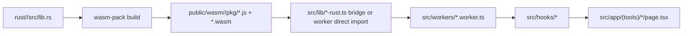
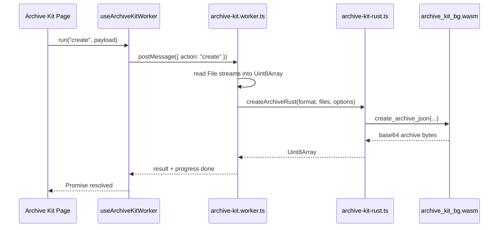

# Rust and WebAssembly in Toolbase

## Purpose
This document explains how Rust is implemented in Toolbase today:
- where Rust code lives
- how it is compiled for the browser
- how Next.js code loads it
- how workers, hooks, and pages interact with it
- what design rules future Rust-backed tools should follow

This is the reference document for anyone maintaining or extending the Rust/WASM architecture in this repository.

## Why Toolbase uses Rust
Toolbase is a local-first product. Many tools process sensitive or heavy data in the browser. Rust is used when a tool benefits from:
- high-performance byte or text processing
- deterministic behavior
- memory safety
- a smaller and more defensible compute core than large JavaScript implementations
- a long-term path away from Python/Pyodide for performance-critical workflows

In the current codebase, Rust is used as a browser-executed engine compiled to WebAssembly, not as a server runtime.

## Current Rust-backed tools
At the time of writing, the Rust crates live under a shared workspace:

```text
rust/
  Cargo.toml
  archive-kit/
  redact-secrets/
```

These tools compile to:

```text
public/wasm/
  archive-kit/pkg/
  redact-secrets/pkg/
```

The browser loads those generated artifacts at runtime.

## High-level architecture
The architecture has five layers:

1. Rust crate
2. Generated WASM package
3. TypeScript runtime bridge
4. Web Worker or hook integration
5. UI page and components

### Flow summary


The important boundary is this:
- Rust owns the compute engine
- TypeScript owns orchestration, file IO from browser APIs, UI state, and progress reporting

## Directory structure

### Rust source
Each Rust-backed tool gets its own crate inside the shared workspace:

```text
rust/<tool>/
  Cargo.toml
  src/
    lib.rs
```

The workspace root lives at:
- [rust/Cargo.toml](/Users/mantt/Documents/OBN/toolbase/rust/Cargo.toml)

Toolbase currently uses one crate per tool inside one workspace. This is the right default because:
- it keeps dependencies isolated
- it allows each tool to evolve independently
- build artifacts map cleanly to public URLs
- failure in one crate does not couple unrelated tools
- shared Cargo behavior can be standardized in one place

### Generated output
Generated browser artifacts are emitted into:

```text
public/wasm/<tool>/pkg/
```

Typical files:
- `<tool>.js`
- `<tool>_bg.wasm`
- TypeScript declaration files generated by `wasm-pack`

These files are build outputs. They are not hand-edited.

### Shared target directory
Toolbase standardizes Cargo build output into a single shared directory:

```text
rust/
  target/
```

Without this, each crate tends to accumulate its own `target/` directory and the Rust area becomes noisy very quickly.

The shared target directory is set during WASM builds through:
- `CARGO_TARGET_DIR=<repo>/rust/target`

## Toolchain and build pipeline

### Rust toolchain
Toolbase pins Rust through:
- [rust-toolchain.toml](/Users/mantt/Documents/OBN/toolbase/rust/rust-toolchain.toml)

Current content:

```toml
[toolchain]
channel = "stable"
```

This keeps local and CI builds aligned on the stable channel.

### npm scripts
The main build scripts are defined in:
- [package.json](/Users/mantt/Documents/OBN/toolbase/package.json)

Relevant scripts:

```json
{
  "build:wasm": "node scripts/build-wasm.mjs",
  "watch:wasm": "nodemon --watch rust -e rs,toml --exec \"npm run build:wasm\"",
  "build": "npm run build:python && npm run build:wasm && next build",
  "dev": "concurrently \"npm run watch:python\" \"npm run watch:wasm\" \"next dev --turbo\""
}
```

Meaning:
- `build:wasm` compiles all Rust crates under `rust/`
- `watch:wasm` rebuilds whenever Rust files change
- `dev` starts Next.js and the Rust watcher together
- `build` ensures WASM artifacts exist before the production Next.js build

### Multi-crate build script
Rust crate discovery is implemented in:
- [scripts/build-wasm.mjs](/Users/mantt/Documents/OBN/toolbase/scripts/build-wasm.mjs)

What it does:
1. scans the `rust/` directory
2. finds every tool folder containing a `Cargo.toml`
3. sets `CARGO_TARGET_DIR` to the shared workspace target directory
4. runs `wasm-pack build <crate> --target web`
5. emits output to `public/wasm/<tool>/pkg`

This means adding a new Rust tool usually does not require modifying the build script. Creating a valid crate under `rust/` is enough for discovery, as long as it is also added to the workspace members.

### Why `--target web`
Toolbase uses:

```bash
wasm-pack build <crate> --target web
```

That generates an ES module wrapper meant to be imported directly by the browser. This matches the current runtime pattern:
- workers are module workers
- the generated JS wrapper is imported dynamically at runtime

### The `wasm-opt` retry behavior
In this environment, `wasm-pack` may fail during optimization with:
- `Operation not permitted (os error 1)`

The build script retries with:
- `--no-opt`

This fallback is build-time only. It does not mean the runtime engine falls back to TypeScript. It only means the wasm binary is emitted without the optional optimization pass.

## Deployment pipeline
Netlify setup lives in:
- [netlify.toml](/Users/mantt/Documents/OBN/toolbase/netlify.toml)

The build command:
1. installs Rust if missing
2. loads Cargo into the shell
3. adds the `wasm32-unknown-unknown` target
4. installs `wasm-pack`
5. installs `wasm-bindgen-cli`
6. runs `npm run build`

This is required because browser WASM artifacts are generated during the site build.

If this pipeline is misconfigured, the app may still build but Rust-backed tools will report engine unavailability at runtime.

## Runtime integration model

### Pattern used in Toolbase
Toolbase does not import Rust crates directly into React components. The pattern is:

1. dynamically import generated JS wrapper
2. initialize it with the `.wasm` URL
3. call exported Rust functions
4. move heavy work into a Web Worker when appropriate

This keeps the UI thread focused on rendering and user interaction.

## Runtime bridge layer

### Archive Kit bridge
The main bridge for Archive Kit is:
- [src/lib/archive-kit-rust.ts](/Users/mantt/Documents/OBN/toolbase/src/lib/archive-kit-rust.ts)

This file does four jobs:

1. Defines the generated WASM module interface
```ts
type ArchiveKitRustApi = {
  default: (wasmUrl?: string | URL | Request) => Promise<unknown>;
  create_archive_json: ...
  list_archive_json: ...
  extract_archive_json: ...
};
```

2. Lazily loads the generated module once
```ts
let rustApiPromise: Promise<ArchiveKitRustApi> | null = null;
```

3. Resolves browser-safe public URLs
```ts
const jsUrl = `${base}/wasm/archive-kit/pkg/archive_kit.js`;
const wasmUrl = `${base}/wasm/archive-kit/pkg/archive_kit_bg.wasm`;
```

4. Converts between browser-native data and Rust-friendly serialized payloads
- `Uint8Array -> base64 string`
- Rust JSON result -> parsed TypeScript objects

### Why base64 + JSON is used
Rust functions exported through `wasm-bindgen` can work with strings very easily. Toolbase currently uses a pragmatic interface:
- byte arrays are encoded as base64
- complex inputs are passed as JSON strings
- Rust returns JSON strings

This is not the most minimal-overhead protocol possible, but it is:
- simple
- debuggable
- stable across tools
- easy to evolve without fragile ABI concerns

That is why Archive Kit exports functions such as:
- `create_archive_json(...)`
- `list_archive_json(...)`
- `extract_archive_json(...)`

and Redact Secrets exports:
- `redact_json(...)`

## Worker layer

### Why workers are used
Rust/WASM does not automatically mean “no UI blocking”. If you call a heavy WASM function on the main thread, the browser can still freeze.

Toolbase therefore puts heavy Rust-backed operations in workers when:
- files are large
- progress reporting matters
- operations can take enough time to disrupt UI responsiveness

### Archive Kit worker
Archive Kit uses:
- [src/workers/archive-kit.worker.ts](/Users/mantt/Documents/OBN/toolbase/src/workers/archive-kit.worker.ts)

Responsibilities:
1. receive messages from the UI
2. stream uploaded files into memory using browser streams
3. report progress back to the page
4. call Rust bridge functions
5. return results or structured errors

Important design choice:
- file reading is done in TypeScript worker code
- archive processing is done in Rust

This split is intentional. Browser `File` and stream handling belongs in the web runtime layer. Archive parsing/packing belongs in the Rust engine.

### Archive Kit hook
The UI talks to the worker through:
- [src/hooks/useArchiveKitWorker.ts](/Users/mantt/Documents/OBN/toolbase/src/hooks/useArchiveKitWorker.ts)

This hook:
- creates the worker as a module worker
- keeps a pending request map
- assigns each job an `id`
- updates UI progress state
- supports cancellation by terminating the worker

This is the standard pattern to copy for future Rust tools with long-running workflows.

### Redact Secrets worker
Redact Secrets uses a simpler worker:
- [src/workers/redact.worker.ts](/Users/mantt/Documents/OBN/toolbase/src/workers/redact.worker.ts)

Why simpler:
- input is mostly text
- there is no multi-step progress protocol like Archive Kit
- one request maps cleanly to one engine call

This worker:
1. loads the generated Rust module
2. accepts `REDACT` messages
3. calls `redact_json(...)`
4. returns `REDACT_RESULT` or `REDACT_ERROR`

### Redact Secrets hook
The React side is:
- [src/hooks/useRedactWorker.ts](/Users/mantt/Documents/OBN/toolbase/src/hooks/useRedactWorker.ts)

It manages:
- singleton worker lifecycle
- ready state
- engine label
- request/response promise wrapping
- explicit failure when the Rust engine is unavailable

## UI layer
The page layer should stay thin. It should not know how to load WASM directly.

Current examples:
- Archive Kit page: [src/app/(tools)/archive-kit/page.tsx](/Users/mantt/Documents/OBN/toolbase/src/app/(tools)/archive-kit/page.tsx)
- Redact Secrets page: [src/app/(tools)/redact-secrets/page.tsx](/Users/mantt/Documents/OBN/toolbase/src/app/(tools)/redact-secrets/page.tsx)

The page should only do product concerns:
- collect inputs
- call hooks/actions
- display progress
- display engine status
- render errors and results

The page should not:
- know generated wasm file names
- know `wasm-pack` conventions
- manage raw module import details

## Rust crate design in Toolbase

### Export shape
Current Rust crates expose string-based APIs via `#[wasm_bindgen]`.

Archive Kit example:
- [rust/archive-kit/src/lib.rs](/Users/mantt/Documents/OBN/toolbase/rust/archive-kit/src/lib.rs)

Redact Secrets example:
- [rust/redact-secrets/src/lib.rs](/Users/mantt/Documents/OBN/toolbase/rust/redact-secrets/src/lib.rs)

Preferred pattern:
1. parse JSON input into Rust structs
2. run pure Rust logic
3. serialize result back to JSON string
4. return `Result<String, JsValue>`

This keeps the exported API small and stable.

### Error model
Rust code converts errors into `JsValue` using helper functions like:

```rust
fn to_js_err<E: std::fmt::Display>(err: E) -> JsValue {
    JsValue::from_str(&err.to_string())
}
```

This matters because the TypeScript side expects browser-friendly string errors.

### Keep exported API narrow
Do not export many tiny functions if they represent one workflow. Prefer one function per meaningful operation:
- create archive
- list archive
- extract archive
- redact text

This reduces bridge complexity and future migration cost.

## Detailed example: Archive Kit

### Rust responsibilities
Archive Kit’s Rust crate owns:
- ZIP create/list/extract
- TAR create/list/extract
- TGZ create/list/extract
- encrypted ZIP support

### TypeScript responsibilities
Archive Kit’s TypeScript layer owns:
- file selection and drag/drop
- reading browser `File` objects into bytes
- UI progress and cancellation
- queue management
- preview rendering
- downloading result blobs

### Why this split is correct
Rust should not be responsible for browser-only abstractions like `File`, DOM, drag-and-drop, or object URLs. Those are UI/runtime concerns. Rust should own archive logic and byte transformations.

### Sequence for create flow


## Detailed example: Redact Secrets

### Rust responsibilities
Redact Secrets’ Rust crate owns:
- pattern-based matching
- entropy scanning
- masking strategies
- request parsing and response shaping

### TypeScript responsibilities
TypeScript owns:
- editor state
- file upload text reading
- worker lifecycle
- display of engine status and errors

### Why Redact Secrets does not need a large bridge file
Its input/output model is simple:
- input: one JSON request
- output: one JSON response

That is why the worker imports the generated module directly rather than going through a separate bridge file.

## Why some tools still use Python
Toolbase is in migration, not in a final all-Rust state. Some tools still use Pyodide because:
- they depend on mature Python libraries
- porting cost is high
- correctness matters more than immediate migration speed

Current Rust design should therefore be treated as the target pattern for CPU-heavy local tools, not yet the universal implementation.

## Current architectural rules

### Rule 1: Rust is compute-only
Rust crates should not know about React, browser components, or page structure.

### Rule 2: Workers own heavy runtime orchestration
If an operation may block, read large files, or needs progress updates, put it behind a worker.

### Rule 3: Page code stays thin
Pages should call hooks and render state, not manage raw WASM loading.

### Rule 4: No silent business-logic fallback for Rust-only tools
For tools intentionally migrated to Rust-only:
- missing artifacts should surface as engine unavailability
- the app should fail clearly
- it should not quietly switch back to a second implementation that doubles maintenance

### Rule 5: Keep the protocol simple
JSON strings and base64 are acceptable when they reduce integration complexity and improve debuggability.

## Adding a new Rust-backed tool

### Step 1: Create the crate
Create:

```text
rust/Cargo.toml
rust/<tool>/
  Cargo.toml
  src/lib.rs
```

Use:
- `crate-type = ["cdylib"]`
- `wasm-bindgen`

Also add the new crate to the workspace members in:
- [rust/Cargo.toml](/Users/mantt/Documents/OBN/toolbase/rust/Cargo.toml)

### Step 2: Export narrow Rust functions
Prefer:
- `process_json(input_json: String) -> Result<String, JsValue>`

or a small set of similarly coarse-grained functions.

### Step 3: Decide bridge pattern
Use one of two patterns:

1. Direct worker import
Good for simple request/response tools like Redact Secrets.

2. Shared TypeScript bridge module
Good for tools with multiple operations and byte conversions like Archive Kit.

### Step 4: Put heavy work behind a module worker
Create:

```text
src/workers/<tool>.worker.ts
src/hooks/use<Tool>Worker.ts
```

Use a message protocol with:
- request `id`
- progress events when useful
- result event
- error event

### Step 5: Keep page orchestration thin
The page should only consume the hook or feature module and render status.

### Step 6: Verify build pipeline
Run:

```bash
npm run build:wasm
npm run type-check
```

If hosting on Netlify, also ensure the build environment can install Rust and `wasm-pack`.

## Common failure modes

### 1. Engine shows unavailable locally
Typical causes:
- `npm run dev` was not used
- `build:wasm` never ran
- browser cache still serves stale worker/module code
- generated artifacts are missing under `public/wasm/<tool>/pkg`

### 2. Generated artifacts exist but runtime still fails
Typical causes:
- worker not created as `type: "module"`
- bad URL resolution inside worker
- stale path assumptions such as relative wasm URLs in blob-backed workers

### 3. Netlify build fails
Typical causes:
- Rust toolchain missing
- `wasm-pack` missing
- target `wasm32-unknown-unknown` not installed
- build step runs before wasm artifacts are generated

### 4. Dual implementations drift
This happens when a Rust tool still keeps an old TypeScript or Python business-logic fallback. Toolbase is intentionally moving away from this for Rust-migrated tools because it creates:
- duplicate bugs
- duplicate test burden
- inconsistent behavior across environments

## Tradeoffs in the current design

### Strengths
- clear separation between UI and compute engine
- easy-to-reason-about build pipeline
- one crate per tool scales cleanly
- worker-based execution keeps UI responsive
- strict Rust-only tools avoid implementation drift

### Costs
- JSON/base64 bridging adds overhead
- artifact generation is required before runtime works
- browser debugging spans TS worker code and Rust logic
- some tools still live in mixed-engine world during migration

## Recommended next improvements

1. Add a shared Rust runtime helper so every bridge does not reimplement:
- module loading
- wasm URL resolution
- singleton caching

2. Add a standard worker protocol helper for:
- request IDs
- progress
- result/error typing

3. Add a Rust migration ADR documenting when a tool should move from Python/TS to Rust.

4. Add automated artifact verification per Rust-backed tool in CI.

5. Add a testing standard for Rust-backed tools:
- Rust unit tests in crate
- TypeScript integration tests around worker bridge
- browser smoke test verifying engine availability

## Summary
In Toolbase, Rust is not an isolated experiment. It is a structured browser-runtime architecture:
- source in `rust/<tool>`
- build via `wasm-pack`
- emitted to `public/wasm/<tool>/pkg`
- loaded through TypeScript bridge or worker
- consumed by hooks
- surfaced in thin Next.js tool pages

Archive Kit shows the full worker + bridge pattern.
Redact Secrets shows the simpler direct-worker pattern.

Future Rust tools should follow one of those two shapes, not invent a third integration style unless there is a strong reason and an ADR to justify it.
