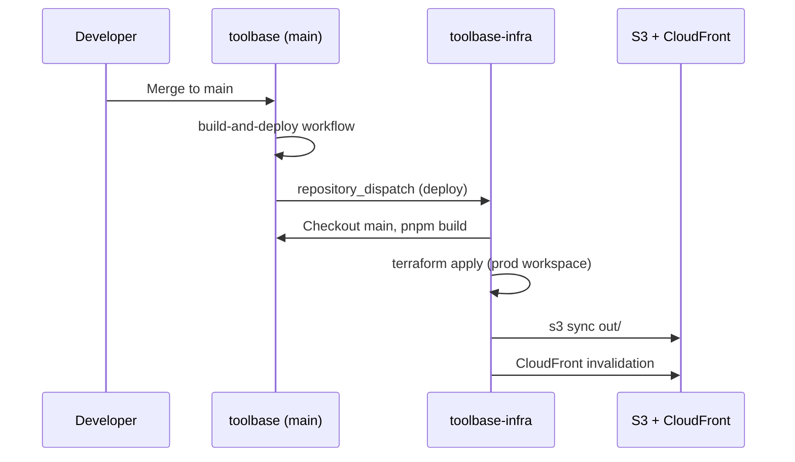

# Deployment

Toolbase is a static Next.js export hosted on AWS (S3 + CloudFront). Application code and infrastructure are split across two repositories.

## Repositories

| Repo | Role |
|------|------|
| [openbuildnetwork/toolbase](https://github.com/openbuildnetwork/toolbase) | Next.js app, WASM/Python bundles, client-only runtime |
| [openbuildnetwork/toolbase-infra](https://github.com/openbuildnetwork/toolbase-infra) | Terraform (S3, CloudFront) and deploy workflows |

## Environments

| Environment | App branch | Infra branch | Terraform workspace |
|-------------|------------|--------------|---------------------|
| Development | `dev` | `dev` | `dev` |
| Production | `main` | `main` | `prod` |

Production is served from the `main` branch build. Development uses the `dev` branch.

## How a production release ships

1. Merge to `main` in **toolbase**.
2. [`.github/workflows/deploy.yml`](../../.github/workflows/deploy.yml) fires and dispatches to **toolbase-infra** with commit SHA and `ref: main`.
3. Infra workflow builds the static site, applies Terraform for `prod`, uploads `out/`, invalidates CDN.

Pushing directly to `main` or `dev` on **toolbase-infra** also runs deploy for that environment (without waiting for app dispatch).

## App workflow (toolbase)

File: `.github/workflows/deploy.yml`

- **Trigger:** push to `main`
- **Action:** `repository_dispatch` to `openbuildnetwork/toolbase-infra` with event type `deploy`
- **Secret:** `INFRA_DISPATCH_PAT` — PAT with rights to trigger workflows on the infra repo

## Infra workflow (toolbase-infra)

See [toolbase-infra README](https://github.com/openbuildnetwork/toolbase-infra/blob/main/README.md) for triggers, secrets (`AWS_ROLE_ARN`, `AWS_ROLE_ARN_PROD`), manual destroy, and Terraform layout.

## Pre-deploy checklist (app changes)

Same as [Release Process](./RELEASE-PROCESS.md) pre-release items: CI green locally (`pnpm lint`, `pnpm type-check`, `pnpm build` or `pnpm build:strict-wasm` when Rust crates changed), registry and routes updated, smoke paths identified.

## Post-deploy verification

1. Open the environment URL (CloudFront domain or custom domain from Terraform output).
2. Hard-refresh or confirm CDN invalidation completed.
3. Run release smoke tests from [Release Process](./RELEASE-PROCESS.md).
4. For WASM/Python changes, confirm worker tools load (no stale CDN asset for `/wasm/` or python bundles).

## Rollback

There is no automated rollback job. Options:

1. Revert the bad commit on `main` (or `dev`) and push — dispatch redeploys the previous good build.
2. Re-run the infra deploy workflow manually for the last known-good ref (checkout uses branch tip; revert is usually simpler).
3. Infrastructure-only issues: use Terraform in **toolbase-infra** or the manual destroy workflow only when intentional.

For incident handling, see [Incident Response](./INCIDENT-RESPONSE.md).
